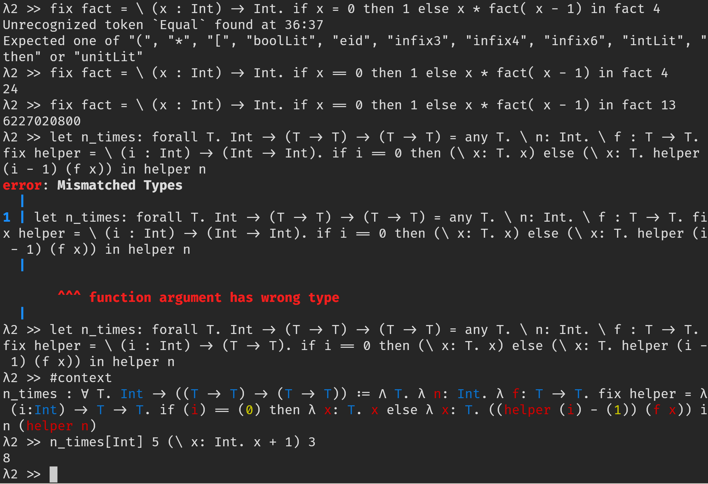

<div id="top"></div>


<!-- PROJECT LOGO -->
<br />
<div align="center">
  <!-- <a href="https://github.com/othneildrew/Best-README-Template"> -->
  <!--    -->
  <!-- </a> -->

  <h3 align="center">Polylamb</h3>

  <p align="center">
    A language implementation for the Polymorphic Lambda Calculus (System F), written in Rust.
    <!-- <br /> -->
    <!-- <a href="https://github.com/othneildrew/Best-README-Template"><strong>Explore the docs »</strong></a> -->
    <!-- <br /> -->
    <!-- <br /> -->
    <!-- <a href="https://github.com/othneildrew/Best-README-Template">View Demo</a> -->
    <!-- · -->
    <!-- <a href="https://github.com/othneildrew/Best-README-Template/issues">Report Bug</a> -->
    <!-- · -->
    <!-- <a href="https://github.com/othneildrew/Best-README-Template/issues">Request Feature</a> -->
  </p>
</div>


<!-- TABLE OF CONTENTS -->
<details>
  <summary>Table of Contents</summary>
  <ol>
    <li>
      <a href="#about-the-project">About The Project</a>
      <ul>
        <li><a href="#built-with">Built With</a></li>
      </ul>
    </li>
    <li>
      <a href="#getting-started">Getting Started</a>
      <ul>
        <li><a href="#prerequisites">Prerequisites</a></li>
        <li><a href="#installation">Installation</a></li>
      </ul>
    </li>
    <li><a href="#usage">Usage</a></li>
    <li><a href="#roadmap">Roadmap</a></li>
    <li><a href="#contributing">Contributing</a></li>
    <li><a href="#license">License</a></li>
    <li><a href="#contact">Contact</a></li>
    <li><a href="#acknowledgments">Acknowledgments</a></li>
  </ol>
</details>


<!-- ABOUT THE PROJECT -->
## About The Project

<!-- This is a (re)implementation of concepts from the paper [*From system F to typed assembly language*](https://dl.acm.org/doi/10.1145/319301.319345) by Greg Morrisett, David Walker, Karl Crary, and Neal Glew. There are a few implementation details that differ from their original implementation. -->

This project originated as a course project for [*CS6120 - Advanced Compilers*](https://www.cs.cornell.edu/courses/cs6120/2022sp/) at Cornell University.

<p align="right">(<a href="#top">back to top</a>)</p>


### Built With

* [Logos](https://github.com/maciejhirsz/logos) - Fast lexer
* [LALRPOP](https://github.com/lalrpop/lalrpop) - LR(1) parser generator
* [rustyline](https://docs.rs/rustyline/latest/rustyline) - REPL library
* [annotate-snippets](https://docs.rs/annotate-snippets/latest/annotate_snippets) - Compiler Error Reporting

<p align="right">(<a href="#top">back to top</a>)</p>


<!-- GETTING STARTED -->
## Getting Started

This is an example of how you may give instructions on setting up your project locally.
To get a local copy up and running follow these simple example steps.

### Prerequisites

1. Have working installation of the Rust compiler toolchain. The recommended way is to use [rustup](https://rustup.rs/).
2. Installing `rust` using the method above should also have installed `cargo`.

### Installation

1. Clone this repository
2. `cd` into the repository
3. Run `cargo install --path compiler` to install the executable of `polylamb`
   - Alternatively, `cd` into the directory `compiler` and run `cargo build`, which should produce an executable in `compiler/target/debug/polylamb`.

<!-- _Below is an example of how you can instruct your audience on installing and setting up your app. This template doesn't rely on any external dependencies or services._ -->

<!-- 1. Get a free API Key at [https://example.com](https://example.com) -->
<!-- 2. Clone the repo -->
<!--    ```sh -->
<!--    git clone https://github.com/your_username_/Project-Name.git -->
<!--    ``` -->
<!-- 3. Install NPM packages -->
<!--    ```sh -->
<!--    npm install -->
<!--    ``` -->
<!-- 4. Enter your API in `config.js` -->
<!--    ```js -->
<!--    const API_KEY = 'ENTER YOUR API'; -->
<!--    ``` -->

<!-- <p align="right">(<a href="#top">back to top</a>)</p> -->


<!-- USAGE EXAMPLES -->
## Usage

### The interpreter REPL


Type `#help` inside the repl to display a list available commands

<!-- Use this space to show useful examples of how a project can be used. Additional screenshots, code examples and demos work well in this space. You may also link to more resources. -->

<!-- _For more examples, please refer to the [Documentation](https://example.com)_ -->

<p align="right">(<a href="#top">back to top</a>)</p>


<!-- ROADMAP -->
## Roadmap
- [x] language [specification](specs/system-F.pdf)
- [x] lexing
- [x] parsing
- [x] type checking
- [x] interpreter
- [ ] CPS transformation
- [ ] assembly emission

<p align="right">(<a href="#top">back to top</a>)</p>

<!-- LICENSE -->
## License

Distributed under the MIT License. See `LICENSE` for more information.

<p align="right">(<a href="#top">back to top</a>)</p>


<!-- ACKNOWLEDGMENTS -->
## Acknowledgments

* [Choose an Open Source License](https://choosealicense.com)
* [Best-README-Template](https://github.com/othneildrew/Best-README-Template) - template for README.md
* [Article about CPS conversion by Matt Might](https://matt.might.net/articles/cps-conversion/)

<p align="right">(<a href="#top">back to top</a>)</p>
